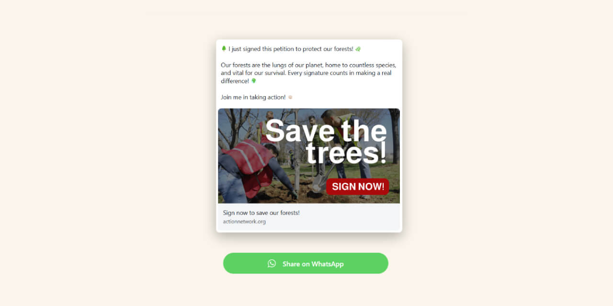

# WhatsApp Share Widget Generator



Allow people in you website to easily share your page by WhatsApp with just 1 click! This easy-to-use tool creates beautiful WhatsApp sharing widgets that help your supporters share your petitions, campaigns, and causes directly with their friends and family.

## 🚀 Why WhatsApp Sharing Works Better

**Personal Connection = Higher Impact**  
Unlike Facebook or X (Twitter) where posts get lost in busy feeds, WhatsApp messages go directly to people your supporters trust most - their family and close friends. When someone shares your petition through WhatsApp, they're having a personal conversation, not broadcasting to strangers.

**The Numbers Don't Lie**  
Studies show that messages shared via WhatsApp have:
- 📈 **5x higher open rates** than social media posts
- 💬 **3x more likely to be read completely** 
- 🤝 **Higher conversion rates** because they come from trusted contacts
- 📱 **Better mobile engagement** since WhatsApp is primarily used on phones

## 🎯 Perfect for Activists & Organizations

### Action Network Integration
Seamlessly works with your Action Network petitions! Simply paste your petition URL, and the tool automatically grabs the title, description, and image to create a professional-looking share widget.

### Lunda Integration - Double Your Impact! 💰
Here's where it gets exciting: Set up a **two-step conversion strategy**
1. **First CTA**: People share your petition via WhatsApp 
2. **Second CTA**: After sharing, they're redirected to your Lunda donation page

**Result**: Your supporters share your cause AND see your donation ask. It's like getting two actions from one click!

### Perfect For:
- 📝 **Petition campaigns** (Action Network, Change.org, etc.)
- 🏛️ **Political campaigns** 
- 🌱 **Environmental causes**
- 🏥 **Healthcare advocacy**
- 🎓 **Education campaigns**
- 💝 **Nonprofit fundraising**

## ✨ What You Get

- 🔄 **Auto-Magic Setup**: Just paste your petition URL and we grab all the details automatically
- 👀 **Live Preview**: See exactly how your message will look in WhatsApp before publishing
- ✏️ **Easy Text Formatting**: Make text **bold**, *italic*, or ~~strikethrough~~ with simple buttons
- 📱 **Mobile-Perfect**: Looks great on phones, tablets, and computers
- 📧 **Email Ready**: Get code that works in both websites and email campaigns
- 🎯 **Smart Redirects**: Send people to your donation page after they share
- 📊 **Character Counter**: Keeps your message within WhatsApp's limits

## 🚀 Try It Now!

**Live Demo**: [WhatsApp Share Widget Generator](https://sharer.wha.chat)  
*Start creating your first widget in under 2 minutes!*

## 📋 Quick Start (No Technical Skills Needed!)

**You don't need to know coding!** This tool is designed for activists, campaign managers, and nonprofit workers who want results, not technical headaches.

### Option 1: Use Our Hosted Version (Easiest)
1. Go to [sharer.wha.chat](https://sharer.wha.chat)
2. Paste your petition or campaign URL
3. Customize your message
4. Copy the code and paste it into your website

### Option 2: Install on Your Own Website

1. **Download the files**
   ```bash
   git clone https://github.com/procom-dev/whatsapp-share-widget.git
   ```

2. **Upload to your website**
   - Contact your web developer or hosting provider
   - They'll need PHP enabled on your server

3. **Start creating widgets!**
   - Open the tool in your browser
   - No configuration needed - it works right away

## 📁 Project Structure

```
whatsapp-share-widget/
├── index.php              # Main application interface
├── fetch-metadata.php     # Server-side metadata extraction
├── assets/
│   ├── css/
│   │   └── style.css      # Complete styling
│   └── js/
│       └── script.js      # Client-side logic
├── images/                # Project images and screenshots
├── 404.html              # Custom 404 error page
├── 502.html              # Custom 502 error page
└── README.md              # This file
```

## 📱 How to Use (Step by Step)

### Creating Your First Widget

1. **📝 Enter Your URL**  
   Paste your Action Network petition, Lunda page, or any campaign URL

2. **🔄 Click "Fetch Data"**  
   The tool automatically grabs your title, description, and image

3. **✏️ Customize Your Message**  
   - Edit the text people will see in WhatsApp
   - Use the formatting buttons to make text **bold** or *italic*
   - Add emojis to make it more engaging! 🌟

4. **🎯 Set Your Redirect (Optional)**  
   Add your Lunda donation page URL so people see your fundraising ask after sharing

5. **📋 Copy Your Code**  
   Choose "Web HTML" for websites or "Email HTML" for email campaigns

6. **🚀 Paste and Publish**  
   Add the code to your website, email, or send it to your web team

### Pro Tips for Better Results
- ✅ Keep messages personal and conversational
- ✅ Include why YOU care about this issue
- ✅ Add relevant emojis (but don't overdo it!)
- ✅ Test the widget on your phone first
- ✅ Use urgent but not alarmist language

## 🎨 Customization

### CSS Customization
The widget styling can be customized by modifying the inline styles in the generated HTML or by overriding with your own CSS.

### PHP Configuration
- Modify `fetch-metadata.php` to customize metadata extraction logic
- Adjust character limits and validation rules in `assets/js/script.js`

## 🌐 Browser Support

- Chrome/Chromium 60+
- Firefox 55+
- Safari 12+
- Edge 79+
- Mobile browsers (iOS Safari, Chrome Mobile)

## 📱 WhatsApp Integration

The generated widgets use WhatsApp's official `wa.me` URL format:
- Format: `https://wa.me/?text=YOUR_MESSAGE`
- Automatically URL-encodes messages
- Preserves WhatsApp formatting in the shared message
- Works on both mobile and desktop WhatsApp

## 🔒 Security Features

- URL validation and sanitization
- XSS protection in metadata extraction
- Safe HTML generation with proper escaping
- CSRF protection through form handling

## 🤝 Contributing & Support

### Found a Bug or Have an Idea?
We'd love to hear from you! Please use [GitHub Issues](https://github.com/procom-dev/whatsapp-share-widget/issues) to:
- Report bugs 🐛
- Request new features 💡
- Ask questions ❓
- Share success stories 🎉

### Want to Contribute Code?
1. Fork the repository
2. Create a feature branch
3. Make your changes
4. Submit a Pull Request

### Need Help?
- 📖 **Documentation**: This README has everything you need
- 🆘 **Issues**: [GitHub Issues](https://github.com/procom-dev/whatsapp-share-widget/issues)
- 💬 **Community**: Share your experience with other activists and developers

## 📄 License

This project is open source (MIT License) - use it freely for your campaigns and causes!

## 🙏 Built for Changemakers

This tool was created specifically for:
- 🏛️ **Political campaigners** fighting for change
- 🌍 **Environmental activists** protecting our planet  
- 📢 **Social justice advocates** demanding equality
- 💝 **Nonprofit organizations** making a difference
- 🗳️ **Grassroots organizers** building movements

*Because every share matters, and every voice counts.*

---

**Ready to amplify your impact? [Start creating widgets now!](https://sharer.wha.chat)** 🚀